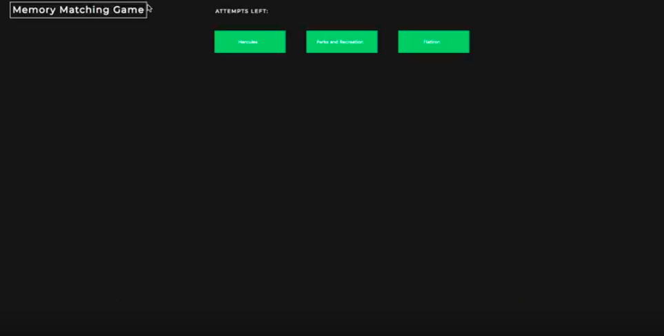

## Memory Mathing Card Game
Card matching game with multiple decks/themes and difficulty levels

## Motivation
To create a fun card matching game utilizing Javascript and Ruby on Rails.

## Demo
A Demo of this project can be found at :

[Youtube](https://www.youtube.com/watch?v=WcOp47L8WvU)

## Built with

* Ruby on Rails
* Javascript

## How to use

This project works in correlation with [Memory Matching Card Game Frontend](https://github.com/Jessicalong627/herculesGameFrontend)
